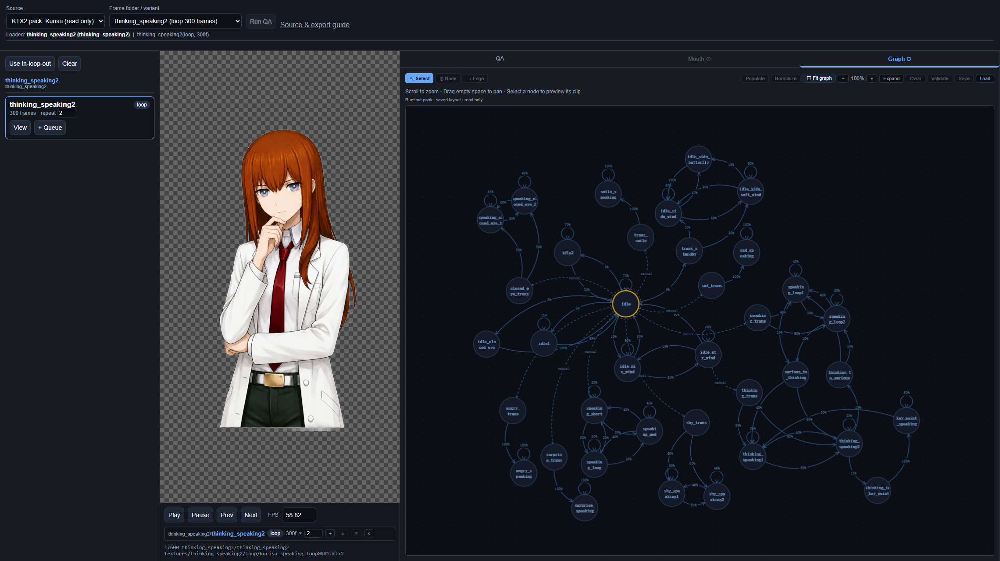
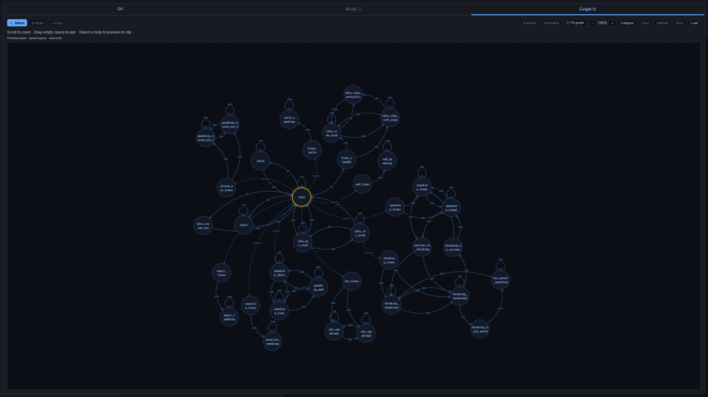
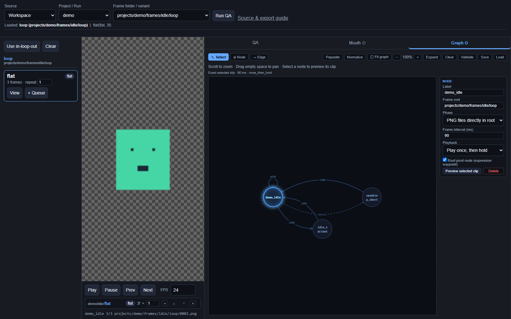

# Amadeus-SpriteForge

Local production, review and behavior graph editing for sprite animation. Turn one
idle reference into approved pose stills and image-to-video clips, review every
generated take, inspect clips and seams, edit a graph, and export a runtime-only
character pack for [Amadeus](https://github.com/Code-Amadeus/Amadeus).

**Status: source alpha, 0.1.0; the production pipeline is experimental.** Image-to-video
providers are optional adapters; the Amadeus application runtime is separate.
[中文说明](docs/README.zh-CN.md)

## Reviewer screenshots



Direct KTX2 playback alongside the creator's saved node layout. This example uses a
separately supplied character pack; the repository's runnable examples use geometric sprites.

<details>
<summary>Expanded behavior graph</summary>



</details>

<details>
<summary>Editable example included in the repository</summary>



</details>

## Try the example

Python 3.10 or newer is required. Reference checks use Windows and Python 3.12.

```powershell
git clone https://github.com/Code-Amadeus/Amadeus-SpriteForge.git
cd Amadeus-SpriteForge
python -m venv .venv
.\.venv\Scripts\python.exe -m pip install ".[qa]"
.\.venv\Scripts\spriteforge.exe init workspace --demo
.\.venv\Scripts\spriteforge.exe review --workspace workspace
```

On Linux/macOS use `.venv/bin/python` and `.venv/bin/spriteforge`. Those platforms
need their own verification; a configured CI job is not completed platform evidence.

Commands below use `spriteforge` for readability. Activate this virtual environment,
or replace it with `.\.venv\Scripts\spriteforge.exe` on Windows and
`.venv/bin/spriteforge` on Linux/macOS. Node.js is only needed to develop/test the UI.

The editor opens at `http://127.0.0.1:7788`. Use `--port 8788` or `--no-browser`
to configure startup. The base installation (`pip install -e .`) has no third-party Python
runtime dependencies. The `qa` extra adds OpenCV and NumPy for image analysis.

The demo is original geometric artwork generated by `spriteforge.demo`; it includes
weighted automatic edges and a zero-weight manual edge. No character pack is needed.

## Direct KTX2 review

```powershell
spriteforge review --workspace examples/runtime-minimal
spriteforge review --workspace path/to/character-pack
```

A directory with `runtime_manifest.json` opens as a **read-only runtime pack**.
Its indexed KTX2 frames are decoded and rendered directly in the browser. PixiJS,
the Basis loader and WASM transcoder are bundled. Viewing needs no PNG originals,
`toktx`, Node.js or CDN connection; a WebGL-capable browser is required.

The verified encoding is Amadeus UASTC KTX2, not every KTX2 variant. Playback,
frame stepping, graph inspection and exact node-clip preview are available. The
renderer bounds its texture cache. Editing and PNG QA remain in the authoring workspace.

Graph view preserves the creator's saved coordinates and curved wiring. Export
writes a separate `<pack-name>.graph-layout.json` beside the runtime directory;
keep it alongside the pack for graph viewing. An existing pack can also use its
original authoring graph explicitly:

```powershell
spriteforge review --workspace path/to/character-pack --layout path/to/authoring/graph_config.json
```

The layout is matched by exact node ID and label and supplies only coordinates;
runtime edges and playback remain authoritative. A pack without saved layout still
plays clips but shows a missing-layout message instead of inventing a default layout.
Use **Fit graph**, wheel or +/- zoom, empty-space dragging, and **Expand** to inspect
large graphs. Viewing never rewrites coordinates or runtime package data.

## Existing assets

```powershell
spriteforge init workspace
spriteforge import --workspace workspace --source path/to/frames --name my-character
spriteforge review --workspace workspace
```

Import copies PNG files and their directory layout into `workspace/projects/`.
Existing projects are not overwritten. You can also open an existing authoring
workspace directly. Review saves `graph_config.json` in that selected directory;
use a copy when evaluating migration.

Select an actual frame folder from the source list. Processed variants are separate
folders; export does not substitute interpolation or alpha versions. The player
supports queues, frame stepping and optional seam QA. The Graph tab supports nodes,
directed edges, root selection, weights, validation, saving and exact node-clip preview.

Each node binds a frame root, phase, interval and loop mode. `flat` means PNGs
directly in root; `in`, `loop`, and `out` select explicit subdirectories. Filenames
are sorted lexicographically, so zero-pad numeric filenames.

One root is required. Positive edge weights are normalized during traversal; zero
is manual. Save validates topology and selected frames before atomically replacing
the graph. An empty new workspace is an unfinished draft until valid nodes are added.

## Production pipeline

The production pipeline is **experimental**. Checked with real media: pose stills and
their normalisation, takes, rendering and QA, mouth overlays, the Kurisu legacy import,
first-frame-only transitions with adopted stills, the canvas, and Wan 3.0 through its
CLI (two clips). The Wan 2.7, Seedance, Qwen image edit and Seedream adapters are only
checked against a local fake API. Interpolation uses GMFSS through
`tools/processors/gmfss_interpolate.py`, as the Kurisu clips did; the wrapper needs
CUDA and has not been run in these checks. See [validation evidence](docs/validation.md).

Produce clips from an idle reference instead of importing finished frames:

```powershell
spriteforge init studio
spriteforge production init --workspace studio --id kurisu --display-name Kurisu --canvas 764x1028
spriteforge production take import --workspace studio --pose idle master.png
spriteforge production take accept --workspace studio --pose idle TAKE
spriteforge production pose add --workspace studio shy
spriteforge production take import --workspace studio --pose shy shy.png
spriteforge production clip add --workspace studio shy_in --from idle --to shy
spriteforge production prepare --workspace studio --clip shy_in --output handoff/shy_in
spriteforge production take import --workspace studio --clip shy_in shy_in.mp4
spriteforge review --workspace studio   # open /production to approve, reject and render
```

The production page opens on a canvas: pose cards with their stills, clip cards with
their own prompt, takes and actions, and wires that show which still starts or ends
each clip and which still was taken from which take. Drag from a pose's port to make a
clip; the Guide button walks through the workflow in English or Chinese.

Pose stills are normalised onto one canvas and must match the base still's head top
and head centre, so every pose overlaps. Each video take keeps its prompt snapshot,
inputs and provider task; you accept one take per clip and rejected takes stay
archived with a reason. Rendering registers both ends of the accepted take to the
pose stills, runs your alpha and interpolation tools, locks the ends and publishes a
graph-bindable folder with explicit timing. Prompts are versioned blocks with
placeholders that never reach a paid provider; `examples/prompt-presets/` has an
optional example of one-sentence video prompts to start from. Pose stills can be generated as
image edits of the base still (Qwen image edit, Seedream) and video takes with Wan 2.7
or Seedance, or with Wan 3.0 through Wan's own CLI on a membership's credits; adapters
read keys from environment variables, and the CLI keeps its own login. A transition can also be
generated from its first frame alone and lend a frame of the result to its end pose
as that pose's still (`production take adopt`), which then anchors every clip that
meets the pose. A character made with the
earlier tools is imported from its legacy workspace and shipped pack with
`production import-legacy plan` and `apply`: poses, clips, mouths and the graph are
rebuilt around the shipped frames, which stay unchanged. See [the production guide](docs/production.md).

## Amadeus export

Install [KTX-Software](https://github.com/KhronosGroup/KTX-Software) separately.
`toktx` is needed only for export and is not bundled. The reference export uses
KTX-Software 4.4.2 with the settings of the shipped Amadeus packs (UASTC level 4,
zstd 18), so a frame encodes to the same bytes as in those packs. Level 4 is slow:
about 1.8 s per 764×1028 frame on the reference machine's CPU.

```powershell
spriteforge validate-graph --workspace workspace
spriteforge export-amadeus --workspace workspace --output exports/demo-v1 --id demo --display-name "Demo" --version 1.0.0 --toktx path/to/toktx.exe
spriteforge validate-pack exports/demo-v1
```

Export reads the same frame list and timing as node preview, encodes textures,
strips authoring fields, validates the staged package, then publishes the local
directory. Existing exports are not overwritten. The result implements
`amadeus.spriteforge.character-pack.v1`:

```text
runtime_manifest.json
graph_config.json
spriteforge_mouth_config.json
textures/**/*.ktx2
```

Speaking loops produced in the production pipeline export **mouth silence
overlays**: a tracked mask per frame and a closed-mouth image tone-matched to the loop,
which Amadeus paints while the character is silent (see
[the production guide](docs/production.md#mouth-overlays-for-speaking-loops)).
A legacy authoring `spriteforge_mouth_config.json` with expressions/profiles still
stops export with an explanation; `--no-mouth` explicitly exports body clips only.

Amadeus still owns semantic aliases, speech transitions, post-speech holds and
presentation priority. Node preview plays a selected clip, not a whole TTS turn.
See [architecture](docs/architecture.md) and [authoring](docs/authoring.md).

## Checks

Contributors should install the development extra first; see [CONTRIBUTING.md](CONTRIBUTING.md).

```powershell
python -m pip install -e ".[qa,dev]"
python -m pytest
node --check src/spriteforge/web/review.js
node --check src/spriteforge/web/production.js
```

Tests cover topology, path containment, rejected saves, HTTP endpoints, preview
bindings, import and export consistency, and the production pipeline on generated
geometric media (stills, takes, prompts, rendering, providers against a local fake
API). Encoder unit tests use a stub; actual encoding is checked separately.
`tools/browser_smoke.cjs` and `tools/production_smoke.cjs` exercise a running
editor with Playwright. See [validation evidence](docs/validation.md).

## Scope and license

The repository contains no private artwork, prompts, API keys, model weights or
personal configuration. Matting and interpolation models are external tools; the
`tools/processors/` wrappers only load them from a path you provide. The wallpaper
scenario editor and the full Amadeus renderer are out of scope; scenario graphs use a
separate contract and need a separate migration.

Project code and generated demo: **AGPL-3.0-only**, consistent with the adapted
Amadeus code. Bundled browser dependencies retain their MIT/Apache licenses; see
[LICENSE](LICENSE), [NOTICE.md](NOTICE.md), and [third-party notices](THIRD_PARTY_NOTICES.md).
Imported user media retains its own license. KTX-Software is installed separately for export.
