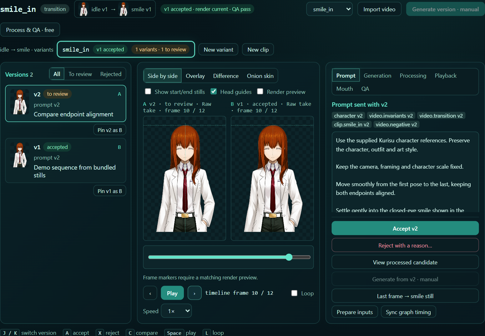
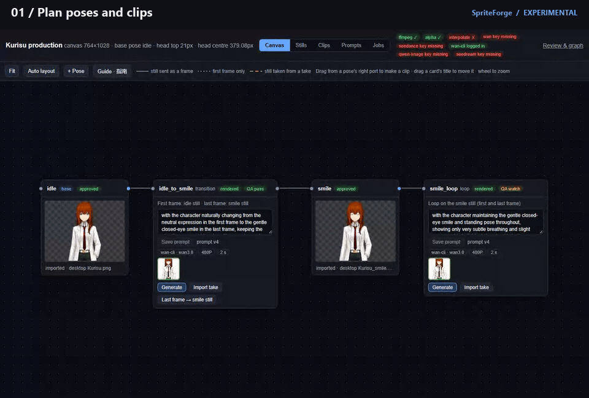

# SpriteForge 资产生产、管理与图编辑工具

从一张 idle 参考图生产角色动画：姿态静帧、图生视频片段、take 审阅、QA、行为图，
最后导出 Amadeus 可用的 KTX2 角色包。图生视频服务是可选适配器，Amadeus 主 runtime
保持独立。组织仓库为 `Code-Amadeus/Amadeus-SpriteForge`。

## Studio 界面

**生成与 QA**、**素材编辑**是两个视图。生成侧包含引导式工作台和 ComfyUI 式节点工作流，
共用同一份素材记录；候选完成处理和 QA 后，由用户明确采纳。编辑侧包含素材库、行为图、
精确播放器、接缝检查、行为统计和版本导出。支持中英文即时切换。



[节点工作流](images/studio-workflows-zh.png) · [审阅与 QA](images/studio-review-zh.png) ·
[图编辑和播放器](images/studio-behavior-zh.png) · [导出](images/studio-export-zh.png)。

## 生产管线动图



12 秒当前界面演示：候选对比 → QA → 采纳 → 素材库与图播放器 → 本地节点工作流。
演示帧由仓库公开参考静帧混合而成，未调用模型；工作流只产出新候选，不改已采纳素材。
[静态总览](images/production-pipeline-poster.png) ·
[用仓库参考图开始体验](../examples/references/kurisu/)。

## 审阅界面


截图展示当前 reviewer 与单独提供的角色包；仓库内可直接运行的示例使用几何图形素材。

## 启动

```powershell
git clone https://github.com/Code-Amadeus/Amadeus-SpriteForge.git
cd Amadeus-SpriteForge
python -m venv .venv
.\.venv\Scripts\python.exe -m pip install ".[qa]"
.\.venv\Scripts\spriteforge.exe init workspace --demo
.\.venv\Scripts\spriteforge.exe review --workspace workspace
```

默认地址 `http://127.0.0.1:7788`，支持 `--port`、`--no-browser`。
已初始化生产的工作区默认打开 Studio，`/production` 也跳转到 `/studio`；
未初始化工作区和运行时角色包继续打开独立 reviewer。
基本编辑、预览和校验仅需 Python 标准库；QA 的可选依赖为 OpenCV 和 NumPy。
示例是自行生成的几何图形，不含现有角色素材。

要体验真实人物生产流程，使用仓库附带的
[四张 Kurisu 参考图与完整上手指南](../examples/references/kurisu/)。
指南从 idle/微笑静帧导入开始，覆盖四段视频、take 采用、渲染、连图、QA、导出。
参考图导入和生成器输入准备不需要模型或付费账号；后续视频生成、抠图和导出需配置对应工具。

## 功能与边界

- 导入 PNG 目录，发现具体帧文件夹及处理版本。
- 播放队列、逐帧检查、接缝 QA、已有口型素材的局部预览。
- 编辑行为图、唯一根节点、手动边和自动遍历权重。
- 明确选择节点帧目录、phase、间隔与循环方式。
- 保存前校验，原子替换图文件；失败保留原图。
- 使用同一份已选帧导出 Amadeus v1 KTX2 运行包。

Graph 的 `Preview selected clip` 与导出共用帧选择、时间和循环配置。
普通队列播放器的 FPS 是人工检视速度，不改变节点的导出间隔。

导出需独立安装 KTX-Software，传入 `--toktx`，命令见根 README。编码参数和已发布的 Amadeus 包一致
（KTX-Software 4.4.2，UASTC 4 级，zstd 18），同一帧编出来的字节相同；4 级较慢，764×1028 一帧约 1.8 秒（CPU）。
生产管线里开启了口型集的说话循环会导出静音闭嘴叠加层（见下方"口型叠加层"）；
旧的作者端 `spriteforge_mouth_config.json` 仍会阻止导出，除非明确选择 `--no-mouth`。
不会偷偷套用旧 Kurisu 专属的帧选择、口型修正或说话策略。

Amadeus 继续负责语义 intent、说话状态、嘴部振幅、呈现优先级、停留和回落。
单段预览不等于完整 TTS 表演模拟。仓库包含精选角色参考静帧；完整角色包、API key、模型权重、
场景图编辑器和完整 renderer 不在仓库内；场景图后续按独立契约整理。
新工作区的 prompt 都是占位符；`examples/prompt-presets/` 保留了原来的中文模板，
并提供完整英文版 `live2d-idle.en.json`。上手指南默认用英文版，保留“风格开头、动作、
自然过渡、其余不变、不夸张、不改变明度”的结构，同时列出完整拼接结果。

## 生产管线

**生产管线目前是实验版。** 用真实素材验证过：姿态静帧及其归一化、take、渲染与 QA、口型叠加层、
旧 Kurisu 角色导入、只用首帧生成过渡并取帧建立静帧、画布，以及通过 CLI 调用 Wan 3.0（两段片段）。
Wan 2.7、Seedance、Qwen 图像编辑和 Seedream 适配器目前只对着本地模拟接口测过。插帧和 Kurisu
片段一样用 GMFSS（`tools/processors/gmfss_interpolate.py`），这个封装需要 CUDA，还没有在这些
验证里实际运行。详见[验证记录](validation.md)。

```powershell
spriteforge init studio
spriteforge production init --workspace studio --id kurisu --display-name Kurisu --canvas 764x1028
spriteforge production take import --workspace studio --pose idle master.png
spriteforge production take accept --workspace studio --pose idle TAKE
spriteforge production pose add --workspace studio shy
spriteforge production take import --workspace studio --pose shy shy.png
spriteforge production take accept --workspace studio --pose shy SHY_TAKE
spriteforge production clip add --workspace studio shy_in --from idle --to shy
spriteforge production prepare --workspace studio --clip shy_in --output handoff/shy_in
spriteforge production take import --workspace studio --clip shy_in shy_in.mp4
spriteforge review --workspace studio   # 打开 Studio 做生成、QA 与素材编辑
```

Studio 默认打开总览。Canvas 工具中的姿态卡显示静帧，片段卡上可以直接改这个片段的 prompt、看 take、生成或导入；
连线表示哪张静帧作为片段的首帧或尾帧，以及哪张静帧取自哪个 take 的第几帧。从姿态的接口拖线就能新建片段，
Guide 按钮里有中英文的分步说明。哪个片段什么时候播放，之后在审阅页的行为图里绑定。

- **静帧是唯一的几何标准**：基准姿态按取景放到画布上，批准后测出头顶和头部中心。
  其他姿态的静帧如果是底图的刚性拷贝（纯表情编辑，≥50% 特征匹配一致）就配准回去；
  姿态变了就保留生成器的构图，要求人工叠加确认。头顶、中心超出容差不能批准，
  确实要动的姿态（侧身、思考）用 `production pose expect` 记录有意偏移。
  也可以沿用旧的链式做法：过渡设为只用首帧生成（`clip set --last-frame none`），
  再用 `production take adopt` 把结果里的一帧（默认最后一帧）作为终点姿态的静帧；
  批准后它同样是固定参照，重新生成过渡不会移动它。
- **Take 不可变、不删除**：每次生成或导入都是一个 take，保存 prompt 快照、首尾帧输入、
  服务商任务号。每个片段只采用一个 take，弃用的 take 带原因留档，可恢复。
- **Prompt 是带版本的数据**：character / 固定约束 / 动作 / 姿态主题分块，保存即新增版本，
  take 记录用到的版本。仍含 `{{PLACEHOLDER: ...}}` 的 prompt 不会提交到付费服务。
- **处理与采纳**：解码（显式 BT.709）→ 可选去保护黑框 → 首帧配准、全片复用同一变换 → pingpong → 插帧处理器 →
  抠图处理器 → 边缘保护 → 首尾锁定到静帧 → QA；人工采纳后发布到
  `production/clips/<id>/output`，帧间隔等时序写进 `render.json`，`graph-sync` 同步到节点。
- **去保护黑框**：默认关闭。Settings 可设置新片段的默认开关，片段的 Processing 面板可单独覆盖，
  并调整黑色阈值和保留边距。扫描整段视频的非黑区域并集，只计算一次裁切框，所有帧使用同一范围，
  不逐帧自动收紧或缩放。原始 take 保留，处理记录保存裁切范围；从片段取帧为静帧也使用同一全片范围。
  该步骤处理已有黑框，不会自动给输入造框，也不能补回已经出画的头部。
- **统一几何变换**：裁切范围、缩放、旋转和位移在整段视频内固定。尾帧配准仅用于 QA 检查偏差，
  不参与逐帧变换插值。这些操作发生在生成侧的“处理与 QA”，采纳后进入素材编辑和行为图。
- **QA**：静帧几何、断帧、闪烁、首尾配准漂移、首尾接缝、循环接缝、图边接缝；
  阈值沿用接缝色差文档（循环 1.0/1.5/2.2 L*，图边 1.2/1.8/2.5 L*）。
  导出时绑定了生产片段的节点若过期、未同步或 QA 失败，导出会被拒绝。
  Review 素材列表中的 `output/<phase>` 路径也接受相同检查；运行 `graph-sync`
  会把它规范化为输出根目录和对应 phase。修改 mouth set 或姿态头部偏移后，嘴型轨迹必须重渲染；
  旧实验版中没有嘴型参数快照的渲染也需要重做一次。
  宽画布预览显示完整帧；所有生产导出（包括无嘴型和 `--no-mouth`）均保留 `canvas_size`。
- **服务商**：静帧用图像编辑接口，以批准的基准静帧为输入生成新姿态——Qwen 图像编辑
  （`DASHSCOPE_API_KEY`）或 Seedream（`ARK_API_KEY`）；take 保存发送的 `input.png`
  及其 sha256，结果照常抠图、归一化和 QA。视频用 Wan 2.7（`DASHSCOPE_API_KEY`）或
  Seedance（`ARK_API_KEY`），也可以通过 Wan 自己的 CLI 用会员积分生成 Wan 3.0（`wan-cli`）。
  API key 只从环境变量读，CLI 用它自己的登录；也可以在网页或 ComfyUI 里手动生成再导入。

抠图和插帧是外部命令（目录进、目录出），`tools/processors/` 提供 anime-segmentation 和
GMFSS 的参考封装。详见 [生产管线说明](production.md)。

### 导入旧角色

用旧工具做的角色（旧 SpriteForge 工作区 + 已发布的角色包）可以直接转成生产角色，不需要重新生成：
`production import-legacy plan` 只读地读取两者，写出可审阅的计划；`apply` 按计划建立生产记录，
中断后重跑即可从断点继续。

- 片段来源：含该片段全部帧名、且 KTX2 旁路目录存在的旧变体目录；多个候选时先把残留的
  KTX2 与包里的纹理比对，再看旧图节点指定的变体。
- 姿态：首尾相接的端点归为一个姿态（循环的首尾、图中每条边的前尾与后首），头部锚点在容差内才合并；
  超出容差的边保留并报告，图 QA 判它的接缝失败，导出会被拦下，需要补过渡片段或删掉这条边。
  不在图里的片段（如 smile、sad）并入脸部最相近的姿态。
- 帧像素不变：矮的帧在顶部补透明行，宽的帧保留宽度作为 `marginPx`；渲染关闭配准、不锁首尾、
  不插帧，帧间隔与发布包一致。
- 口型：沿用发布包的口型组和闭嘴图，即循环自己的某一帧（`frame:N`），或包里用到的另一姿态端点
  （基准姿态就是 `shared` 公共闭嘴帧）。

## 口型叠加层

说话循环里的嘴型就是视频本身；运行时只在"没在说话或 RMS ≤ 0.08"时，
在嘴部椭圆遮罩里贴一张闭嘴图。RMS 只决定显不显示，不选嘴型。所以生产端只算：

- **遮罩轨迹和范围**：在预期位置附近找说话时变化最大的区域定嘴，再逐帧模板跟踪（每帧最多 6px，中值平滑）；
- **闭嘴图和图上的嘴位置**，并按这个循环的肤色调色；
- **每帧"离闭嘴多远"**，运行时只在停帧、降帧采样时用它挑最闭嘴的一帧。

`production clip set C --mouth neutral` 开启（只允许循环）。闭嘴图默认用**共用闭嘴帧**
（基准 idle 静帧，所有表情复用），不用第 0 帧，因为从过渡进入的循环第 0 帧不一定闭嘴。
侧面等脸型不同的姿态用 `production mouth pose side --use side` 单独指定；
`production mouth shared POSE` 更换共用帧；单个片段可用 `--mouth-source still|frame:N|pose:ID` 覆盖。

共用闭嘴帧来自别的表情，肤色会不同（脸红、调色）。渲染时会在遮罩覆盖的嘴周皮肤上比较
循环和闭嘴图的平均 Lab，把闭嘴图的嘴部区域平移到循环的色调，结果存为
`output/.mouth/closed.png`，导出直接编码这张；平移超过 8 L* 会在 QA 里提示。
生产页的"模拟静音"预览按运行时同样的方式画遮罩、贴闭嘴图。

代码和几何示例采用 AGPL-3.0-only，与迁入的 Amadeus 合同代码保持一致。
用户素材的许可不因此改变。来源见 `NOTICE.md`。


## 直接查看 KTX2

```powershell
spriteforge review --workspace examples/runtime-minimal
spriteforge review --workspace path/to/character-pack
```

检测到 runtime_manifest.json 时，按只读运行包打开，直接解码、显示和播放索引中的
KTX2，无需 PNG 原图或 toktx。PixiJS 和 Basis JS/WASM 解码器随仓库和 wheel 提供，
不依赖 CDN。需要支持 WebGL 的浏览器；已验证 Amadeus 使用的 UASTC KTX2，不宣称
覆盖所有 KTX2 编码。可播放、逐帧检查和查看行为图；图编辑及 QA 留在作者工作区。
