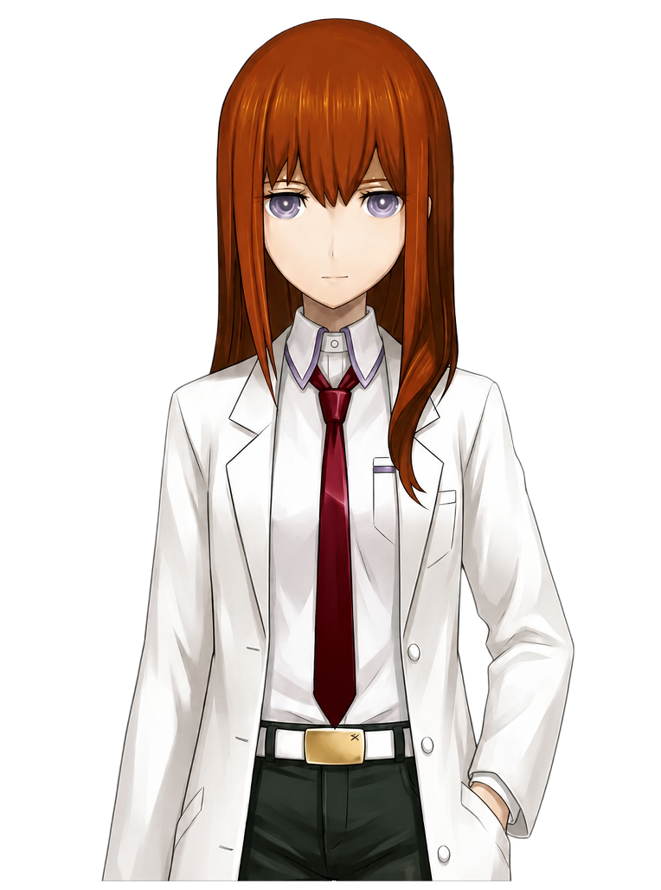
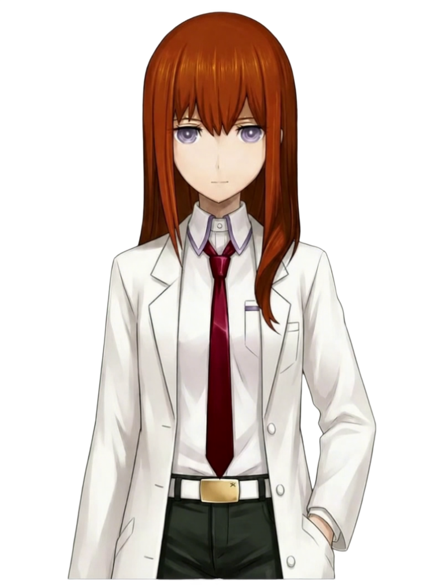
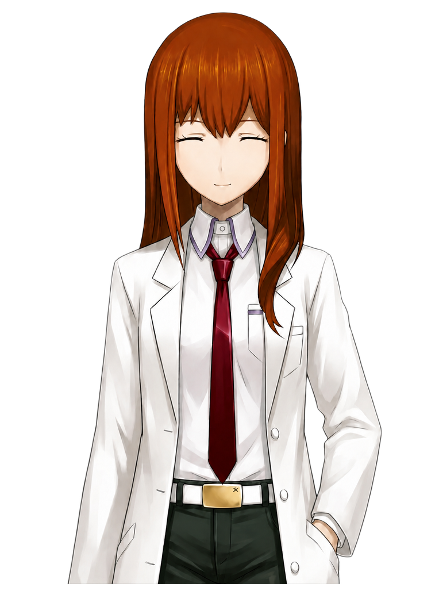
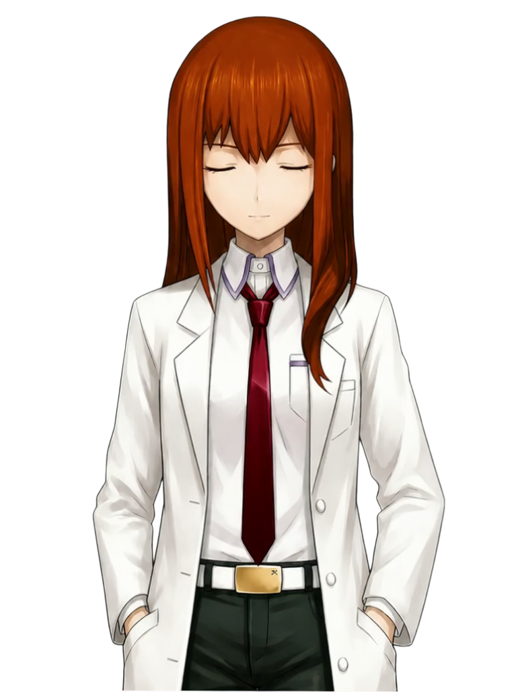

# Kurisu idle references / idle 参考图

Four maintainer-supplied, normalized RGBA stills are included so a new checkout has
real character references for the production workflow. Every image is **764x1028**.
They are still images, not an animation pack. The PNGs contain image data only;
local workspace records and provider configuration are not included.

| Current reference pair / 推荐起步组合 | Legacy alignment references / 旧管线对齐参考 |
| --- | --- |
|  |  |
| `idle-reference.png` — neutral idle, normalized from the reference used in the Wan 3.0 trial. | `legacy-idle-reference.png` — approved idle still from the imported legacy production. |
|  |  |
| `idle-smile-reference.png` — matching closed-eye smile, registered to the current idle. | `legacy-closed-eye-reference.png` — approved closed-eye pose from the legacy production. |

Start with the **left-hand pair**. The legacy stills preserve a different production's
framing and tone; use them for comparison, or as a separate character workspace.

建议新用户先使用左侧的 **idle + 闭眼微笑** 两张图。右侧保留旧管线的构图和色调，
适合作为对齐参考，或在另一个工作区中使用。不要直接混用两套基准。

## Start a production workspace / 从参考图开始

Install the repository with the `qa` extra as described in the [main README](../../../README.md#try-the-example),
activate the virtual environment, and run these commands from the repository root.
Use a **new** workspace name. These images already have alpha and are placed on the
canvas, so `--place 1,0,0` preserves their pixels and requires no matting model.

先按主 README 安装并激活环境，在仓库根目录运行下列命令。图片已经抠图并放置好，
`--place 1,0,0` 会保留现有位置，不需要重新抠图。每次导入会打印一个 take ID；
把下面的 `IDLE_TAKE`、`SMILE_TAKE` 分别替换成刚打印的 ID 再批准。

```text
spriteforge init reference-studio
spriteforge production init --workspace reference-studio --id kurisu-reference --display-name Kurisu --canvas 764x1028
spriteforge production take import --workspace reference-studio --pose idle examples/references/kurisu/idle-reference.png --place 1,0,0
spriteforge production take accept --workspace reference-studio --pose idle IDLE_TAKE
spriteforge production pose add --workspace reference-studio smile
spriteforge production take import --workspace reference-studio --pose smile examples/references/kurisu/idle-smile-reference.png --place 1,0,0
spriteforge production take accept --workspace reference-studio --pose smile SMILE_TAKE
spriteforge production clip add --workspace reference-studio idle_to_smile --from idle --to smile
spriteforge production clip add --workspace reference-studio smile_loop --from smile --to smile
spriteforge production prompt import --workspace reference-studio examples/prompt-presets/live2d-idle.en.json
spriteforge production prompt set --workspace reference-studio clip.idle_to_smile --text "with the character naturally changing from the neutral expression in the first frame to the gentle closed-eye smile in the last frame, keeping the standing pose and hand positions unchanged and settling smoothly into the supplied final pose"
spriteforge production prompt set --workspace reference-studio clip.smile_loop --text "with the character maintaining the gentle closed-eye smile and standing pose throughout, showing only very subtle breathing and slight movement in individual strands of hair, then returning naturally to the supplied starting pose for a seamless loop"
spriteforge production prepare --workspace reference-studio --clip idle_to_smile --output reference-handoff
spriteforge review --workspace reference-studio
```

Replace `IDLE_TAKE` and `SMILE_TAKE` with the IDs printed by their imports. Open
`http://127.0.0.1:7788/production` to see the two approved poses and two planned clips.
`reference-handoff/` contains the first/last frame PNGs and prompt for an external
video generator. The commands above make **no provider calls** and generate no video.

打开 `/production` 后可看到两张批准的静帧和两个待制作片段。`reference-handoff/`
包含可直接交给视频生成器的首尾帧及 prompt；以上步骤不会调用付费服务，也不会自动生成视频。

To continue, generate a take through a configured provider or import one made
externally. Video rendering needs FFmpeg and an alpha processor; interpolation is
optional and needs its own processor. KTX2 export needs `toktx`. See the
[production guide](../../../docs/production.md) for these later steps. New image-edit
poses require an image provider or an externally created image; the supplied smile
lets you try the initial transition without that dependency.

后续可配置服务商生成视频，也可在外部生成后导入。视频渲染需要 FFmpeg 和抠图处理器；
插帧是可选步骤，KTX2 导出需要 `toktx`。这些外部工具、模型权重和账号仍需自行配置。

## Finish the workflow / 完整后续流程

### 1. Plan the root loop and return / 补齐根循环和返回段

The initial setup above creates a transition and a smile loop. Add an idle loop
for the graph root and a return transition so playback can return to idle:

上面的步骤已有进入微笑和微笑循环；再补 idle 根循环、返回 idle 的过渡，形成完整路径。

```text
spriteforge production clip add --workspace reference-studio idle_loop --from idle --to idle
spriteforge production clip add --workspace reference-studio smile_to_idle --from smile --to idle
spriteforge production prompt set --workspace reference-studio clip.idle_loop --text "with the character maintaining the neutral expression and standing pose in the reference image, showing only very subtle breathing and slight movement in individual strands of hair, then returning naturally to the supplied starting pose for a seamless loop"
spriteforge production prompt set --workspace reference-studio clip.smile_to_idle --text "with the character naturally opening both eyes and relaxing the smile from the first frame into the neutral expression in the last frame, keeping the standing pose and hand positions unchanged and settling smoothly into the supplied final pose"
spriteforge production prompt render --workspace reference-studio --clip idle_loop
```

Check that each clip's prompt preview is complete (`complete=True`). The preset
fills the shared video blocks; each of the four clips still needs its own action
text, supplied by these commands. Still-image prompts remain placeholders until
you choose to generate additional poses.

确认四个片段的 prompt 预览完整；如果仍显示 `PLACEHOLDER`，先补齐对应块。
新增姿态的生图 prompt 是另一组配置，本示例已经提供两张静帧，不需要调用生图接口。

The guide uses the **complete English version of the original template**:
Live2D-style opening → the clip's action → natural transition, everything else
unchanged, no exaggerated movement, constant brightness. The `--text` values above
edit only the action block; they are **not the entire provider prompt**. `prepare`
writes the assembled prompt below to `prompt.txt`. All constraints stay in the
positive prompt, including for Wan CLI, which has no separate negative-prompt option.

使用原模板的完整英文版：Live2D 风格开头 → 片段动作 → 最自然的过渡、其余保持不变、
不夸张、不改变明度。上面 `--text` 只编辑动作块；最终发送或复制的是 `prepare`
导出的完整 `prompt.txt`。以下是四个片段完整拼接后的英文提示词。

**Idle → smile**

```text
Create a natural Live2D-style idle animation clip, with the character naturally changing from the neutral expression in the first frame to the gentle closed-eye smile in the last frame, keeping the standing pose and hand positions unchanged and settling smoothly into the supplied final pose, using only the most natural transitions, keeping everything else unchanged, avoiding any exaggerated movement, and keeping brightness constant
```

**Smile loop**

```text
Create a natural Live2D-style idle animation clip, with the character maintaining the gentle closed-eye smile and standing pose throughout, showing only very subtle breathing and slight movement in individual strands of hair, then returning naturally to the supplied starting pose for a seamless loop, using only the most natural transitions, keeping everything else unchanged, avoiding any exaggerated movement, and keeping brightness constant
```

**Idle loop**

```text
Create a natural Live2D-style idle animation clip, with the character maintaining the neutral expression and standing pose in the reference image, showing only very subtle breathing and slight movement in individual strands of hair, then returning naturally to the supplied starting pose for a seamless loop, using only the most natural transitions, keeping everything else unchanged, avoiding any exaggerated movement, and keeping brightness constant
```

**Smile → idle**

```text
Create a natural Live2D-style idle animation clip, with the character naturally opening both eyes and relaxing the smile from the first frame into the neutral expression in the last frame, keeping the standing pose and hand positions unchanged and settling smoothly into the supplied final pose, using only the most natural transitions, keeping everything else unchanged, avoiding any exaggerated movement, and keeping brightness constant
```

### 2. Generate or import four takes / 生成或导入四段视频

For a first experiment, use the manual route. `prepare` writes the exact first and
last frames and prompt for each clip. Run it for the remaining three clips too;
the initial transition was already prepared as `reference-handoff/` above.

```text
spriteforge production prepare --workspace reference-studio --clip idle_loop --output handoff/idle_loop
spriteforge production prepare --workspace reference-studio --clip smile_loop --output handoff/smile_loop
spriteforge production prepare --workspace reference-studio --clip smile_to_idle --output handoff/smile_to_idle
```

Use those inputs in an image-to-video service that supports first and last frames.
For each loop, first and last are the same pose. Keep the framing and background
fixed. Save each resulting video locally, then import it using the matching clip ID:

```text
spriteforge production take import --workspace reference-studio --clip idle_loop videos/idle_loop.mp4
spriteforge production take import --workspace reference-studio --clip idle_to_smile videos/idle_to_smile.mp4
spriteforge production take import --workspace reference-studio --clip smile_loop videos/smile_loop.mp4
spriteforge production take import --workspace reference-studio --clip smile_to_idle videos/smile_to_idle.mp4
```

The `videos/` files are your generated results; they are not bundled. On the
Production page, preview each take and choose **Use this take**. Rejected takes
stay archived. CLI users can instead run
`spriteforge production take accept --workspace reference-studio --clip CLIP_ID TAKE_ID`.

把 `prepare` 导出的首尾帧和 prompt 交给支持首尾帧的视频服务。循环的首尾图相同。
生成结果按上面的片段 ID 导入，在 Production 页面逐条预览、采用或带原因弃用。
`videos/*.mp4` 是你自己生成后保存的文件，仓库不附视频。

Alternatively, configure an adapter and use **Generate** on the clip card. See
[providers](../../../docs/production.md#providers) and
[Wan CLI account credits](../../../docs/production.md#wan-through-its-cli-subscription-credits).
Generation uses your own provider account/credits; these instructions do not supply
credentials. Start with one take and inspect it before generating the rest. Provider
and GPU validation limits are listed in the [main README](../../../README.md#production-pipeline).

也可以配置自己的 API key 或 Wan CLI 登录，然后在卡片上点 Generate，费用由对应账号承担。
建议先试一段确认效果，再做其余片段。

### 3. Configure processing, then render / 配置处理器并渲染

Importing a video does not remove its background. Install FFmpeg and confirm
`ffmpeg -version` works in the terminal that starts SpriteForge. Configure the
`alpha` entry in `reference-studio/production/tools.json` using the
[processor contract and command examples](../../../docs/production.md#rendering).
For the supplied anime-segmentation wrapper, its Python environment must have the
model's dependencies, and `--repo` and `--checkpoint` must point to your local model
code and weights. They are not included in the SpriteForge installation. CPU is
supported via `--device cpu`; use absolute paths for the executable, wrapper and model.
Keep the other fields of `tools.json`, including its `format` and providers.

先安装 FFmpeg，再在 `production/tools.json` 配好真实抠图处理器。安装 SpriteForge 的
`qa` 依赖不会自动安装抠图模型和权重；请给处理器使用具备模型依赖的 Python 环境，
填写自己的模型目录、权重路径。初次体验可使用 CPU；保留 `tools.json` 的其他字段。
本示例默认不插帧，不需要 GMFSS。需要插帧时再单独配置插帧处理器和 GPU 环境。

After accepting all four video takes, click **Render accepted take** for each clip,
or render all missing/stale clips:

```text
spriteforge production render --workspace reference-studio --stale
spriteforge production status --workspace reference-studio
```

Inspect the rendered previews and QA messages. `watch` and `fix` call for review;
`fail` blocks export. Changing an accepted take, a pose still, processing settings
or the shared mouth inputs may require another render. A default transition locks
18 frames across its ends, so a shorter take must use smaller lock settings or be
replaced with a longer take.

逐条查看渲染预览和 QA；`fail` 会拦导出。片段过短时可能不够默认的首尾锁定长度，
需使用更长的 take 或合理调整锁定帧数。修改了来源或处理参数后，重新渲染过期片段。

### 4. Build the behavior graph and check seams / 连行为图并检查接缝

```text
spriteforge production graph-sync --workspace reference-studio --add-missing
spriteforge review --workspace reference-studio
```

Use **Review & graph** (the `/` page), then the Graph tab. `idle_loop` should be the
single root. Graph-sync adds nodes and timing; it does **not** invent the edges.
Connect and save a small graph such as:

| From | To | Weight / 权重 |
| --- | --- | ---: |
| `idle_loop` | `idle_loop` | 1 |
| `idle_loop` | `idle_to_smile` | 0 (manual / 手动触发) |
| `idle_to_smile` | `smile_loop` | 1 |
| `smile_loop` | `smile_loop` | 3 |
| `smile_loop` | `smile_to_idle` | 1 |
| `smile_to_idle` | `idle_loop` | 1 |

Positive weights choose automatic outgoing edges proportionally. Weight zero
means manual, not automatic. Preview individual nodes, then validate the saved graph:

```text
spriteforge validate-graph --workspace reference-studio
spriteforge production qa --workspace reference-studio
```

在 Review 的 Graph 标签页连接并保存上面的边，确保只有 `idle_loop` 是根。
`graph-sync` 只同步节点和时序，不会替你决定播放路线。正权重用于自动选择，0 表示手动。
图 QA 的 `fail` 需要回到对应片段或静帧处理；保存后再次检查。

### 5. Export and share / 导出和分享

Install KTX-Software separately. If `toktx --version` works on PATH, export to a
new destination (an existing output directory is never overwritten):

```text
spriteforge export-amadeus --workspace reference-studio --output exports/kurisu-reference-v1 --id kurisu-reference --display-name Kurisu --version 0.1.0
spriteforge validate-pack exports/kurisu-reference-v1
spriteforge review --workspace exports/kurisu-reference-v1
```

If `toktx` is not on PATH, add `--toktx "path/to/toktx"` to the export command.
Share the entire exported pack directory. Keep the adjacent
`kurisu-reference-v1.graph-layout.json` if you also want the saved graph layout.
The runtime pack contains KTX2 textures, graph, timing and mouth configuration;
it does not need the original workspace, model weights or provider credentials
for review. Export does not install or replace an Amadeus character automatically.
Amadeus's speaking/intent label conventions are described in the
[production guide](../../../docs/production.md#mouth-overlays-for-speaking-loops).

导出需要另装 `toktx`；完成后先 `validate-pack`，再用 reviewer 打开验证播放。
分享整个导出目录，需要保留图布局时再带上旁边的 `.graph-layout.json`。
这份入门示例制作的是 idle/微笑身体动画；说话循环与静音闭嘴层是后续可选步骤，
详见生产指南。生成角色包不会自动替换 Amadeus 已安装的人物资源。

## What is ready after cloning? / 下载后能直接做什么

- **Ready:** inspect four references, import and approve the current pair, edit
  prompts, prepare generator inputs, and run the geometric review demo.
- **Requires your setup:** video generation/account, FFmpeg and a matting processor
  for generated video, optional GMFSS interpolation, and `toktx` for pack export.
- **就绪：**参考图、静帧导入和审批、prompt 编辑、首尾帧准备、几何 demo 预览。
- **自行配置：**视频生成账号、FFmpeg、抠图模型；按需配置插帧，以及导出用的 `toktx`。

## Provenance

These are the maintainer's published character reference images, copied from
approved production stills without resampling. They are separate from the original
geometric demo and are not covered by the project's code/demo AGPL grant. See
[NOTICE.md](../../../NOTICE.md) for the distinction between code, demo and character artwork.
